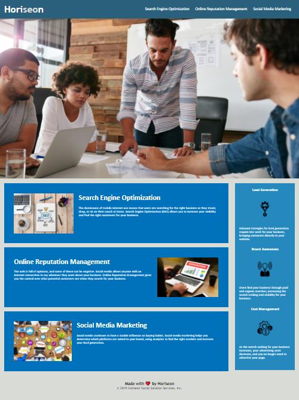

# Horiseon Webite Update

Project assignment was to update Horiseon website's codebase to meet current accessibility standards. Client requested these standards to be updated in order to ensure highest quality experience for all users as well as optimize the site for latest in search engine criteria.

---
## Changes made to site

 - Assessed, adjusted and tested page links to ensure proper function.
 - Went through html code and modified semantic structure where necessary in order to improve search engine optimization. 
 - Added Alt-attributes to any images that were missing a text description in order to meet current accessibility standards. 
 - Adjusted CSS selectors and properties to consolidate where possible and eliminate redundancy. 
 - Added comments in html and css files to make a record of fixes that were made to code. 

---

- Link to deployed site: https://mjpagenkopf.github.io/hw01_code_refactor/

- Link to repository: https://github.com/mjpagenkopf/hw01_code_refactor

---

### Screenshot for Reference:

